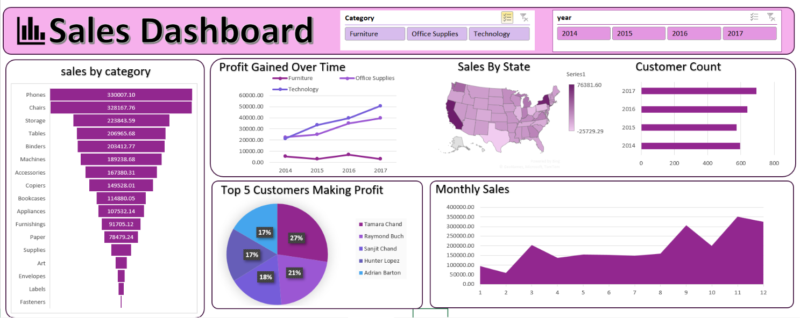

# 📊 Sales Dashboard | Excel Project

[](https://www.microsoft.com/excel)
[](https://www.microsoft.com/excel)

## 📌 Project Overview
An interactive Excel dashboard analyzing **9,994 retail sales orders** across the United States from **2014 to 2017**, covering 3 product categories, 17 sub-categories, 793 unique customers, and 49 states. Built entirely in Excel using pivot tables, pivot charts, and slicers — no external tools required.

**Goal:** Give sales managers a single-page interactive view of revenue trends, profitability by category, geographic performance, top customers, and monthly seasonality — filterable by category and year.

## 🎯 Business Problem
Retail sales managers need to track what's selling, who's buying, where revenue is coming from, and whether the business is actually making money — not just generating revenue. This dashboard answers:
- Which product categories and sub-categories drive the most sales and profit?
- How is profit trending year-over-year across all three categories?
- Which states generate the most sales revenue?
- Which customers are the most profitable, and how has customer count grown?
- Which months are seasonally strongest for sales?

## 📊 Dataset
| Field | Detail |
|---|---|
| Records analyzed | 9,994 order lines |
| Period | January 2014 – December 2017 |
| Source file | [`sales_data.csv`](./data/sales_data.csv) |
| Fields | Order Date, Customer Name, State, Category, Sub-Category, Product Name, Sales, Quantity, Profit |
| Categories | Furniture, Office Supplies, Technology |
| States covered | 49 US states |

## 🛠️ Tools & Approach
1. **Excel Data Model** – Loaded `sales_data.csv` into Excel and structured it for pivot analysis.
2. **Pivot Tables** – Built pivot tables for sales by sub-category, profit by category over time, sales by state, customer count by year, top 5 customers by profit, and monthly sales trend.
3. **Pivot Charts** – Created 6 charts (bar, line, map, pie, area) from the pivot tables.
4. **Slicers** – Added Category (Furniture / Office Supplies / Technology) and Year (2014–2017) slicers connected to all charts for interactive cross-filtering.
5. **Dashboard Sheet** – Arranged all 6 charts professionally on a single dashboard sheet.

## 📈 Dashboard Preview

## 🔍 Key Insights (from the actual 9,994-row dataset)
- **Total Sales: $2.30M** over 4 years with **$286K in total profit** — an overall margin of **12.47%**, meaning roughly 12 cents of profit for every dollar of revenue.
- **Revenue grew 51% from 2014 to 2017** ($484K → $733K), while profit grew **89%** ($49.5K → $93.4K) — profit is growing nearly twice as fast as revenue, indicating improving operational efficiency over time.
- **Technology is the most profitable category** ($145K profit) despite being first in revenue — while Furniture generated $742K in sales but only $18.5K in profit, a margin of just 2.5% vs. Technology's 17.4%.
- **Tables are actively losing money** (-$17,726 in profit) despite $206K in sales — the single biggest profit drain in the entire product catalog and a clear candidate for repricing or discontinuation.
- **Bookcases also run at a net loss** (-$3,473), meaning 2 of the 17 sub-categories are eroding overall profitability while appearing healthy on a revenue-only view.
- **Phones ($330K) and Chairs ($328K) are the top 2 revenue sub-categories** — nearly neck and neck, together accounting for 28.6% of all revenue.
- **California ($457K) and New York ($311K) are by far the top 2 states**, together contributing 33.4% of total revenue from just 2 of 49 states.
- **Tamara Chand is the most profitable single customer** ($8,981 profit), with the top 5 customers (Tamara Chand, Raymond Buch, Sanjit Chand, Hunter Lopez, Adrian Barton) contributing a combined **$32,782 in profit — 11.4% of total profit** from just 5 of 793 customers.
- **Customer count grew from 595 (2014) to 693 (2017)** — a 16.5% increase in the customer base over 4 years, showing steady business growth.

## 🚀 How to Use This Project
```bash
git clone https://github.com/ankitabisht-data-analyst/sales-dashboard-excel.git
```
1. Open [`sales_dashboard.xlsx`](./excel/sales_dashboard.xlsx) in Microsoft Excel (2016 or later recommended).
2. Navigate to the **Dashboard** sheet to view the final output.
3. Use the **Category** slicer (Furniture / Office Supplies / Technology) and **Year** slicer (2014–2017) to filter all charts simultaneously.
4. To explore the underlying pivot tables, check the individual sheets in the workbook.

## 📈 Skills Demonstrated
`Excel` `Pivot Tables` `Pivot Charts` `Slicers` `Dashboard Design` `Data Cleaning` `Sales Analytics` `KPI Reporting` `Data Visualization` `Profitability Analysis`

## 📬 Contact
**Ankita Bisht** — Data Analyst
[LinkedIn](https://www.linkedin.com/in/ankita-bisht09) · [GitHub](https://github.com/ankitabisht-data-analyst)

⭐ If you found this project useful, consider giving it a star!
